# VEYRA First Ordinary Phone — Visual Exploration V1

Status: Draft — Historical Exploration / Rejected Home Candidate. **NOT
Accepted.** No visual direction is selected.
Scope: Historical visual and product-language exploration of the former
Personal Index structure. The Personal Index Home concept was rejected by an
explicit later human product decision. Communication, Money, and Settings work
may still inform a revised visual pass where it agrees with the accepted
first-phone contract. This document selects no structure, world truth, or
implementation.

Structural design authority (revised and authoritative over this document):
[`VEYRA_FIRST_ORDINARY_PHONE_V1.md`](VEYRA_FIRST_ORDINARY_PHONE_V1.md).
Parent identity authority:
[`VEYRA_COMPANY_PRODUCT_IDENTITY_V1.md`](VEYRA_COMPANY_PRODUCT_IDENTITY_V1.md).

---

## 1. What this document is and is not

This was the visual exploration pass for the former accepted structure. It is
retained as historical exploration and does not redefine the revised accepted
contract.

It went through one round of human review. §11 records that review's result and
§12–§14 carry the candidate it produced. The Personal Index Home in that
candidate is now rejected. The exploration remains useful only as
non-authoritative history and as possible input to revised internal screens.

It is **not** a product-structure authority. Where anything here appears to
disagree with the accepted first-phone contract, the accepted contract wins and
this document is wrong. It creates no simulation state, selects no NPC, no Device
model, no VEYRA OS release, no authored content, and authorizes no
implementation.

VEYRA remains unimplemented. `docs/current/` is untouched by this pass.

### Placeholder content

Every person, message, device name, system version and account reference in the
reference images is **VISUAL MOCKUP CONTENT — NOT SELECTED CANONICAL WORLD
TRUTH**. It exists only to make hierarchy judgeable. Nothing in it selects a
correspondent, an owner, a conversation, a Device display name, a Firmware
release, or a Transaction.

One thing in the images is deliberately shape-truthful rather than invented,
because its represented shape is already known and designing against a fake shape
would have wasted the pass: activity rows carry only what a represented
Transaction actually projects — a counterparty account-reference snapshot,
direction, and a signed amount, with no timestamp, merchant, category, fee or
status. The account references themselves, and the fact that any Transaction
exists at all, are mockup. Initial represented state has **no** Transactions, so a
truthful first render of Money would show the empty case; activity is drawn only
so activity presentation can be judged.

`Civic Dollar` is the represented Provider display name
(`docs/current/DOLLAR_FINANCE.md`). It appears because the accepted contract
explicitly contemplates VEYRA presenting Civic Dollar; it selects no Account and
no relationship between that Provider and any foreign Device.

**Balances differ between rounds, deliberately.** The round-1 direction boards use
`$1,250.00`, the represented initial Dollar Account balance. That was too close to
implying the future foreign Device owns the player's Account, so the selected
candidate in §12 uses an obviously illustrative `$248.60` instead. No balance in
any image is a selection.

---

## 2. Repository truth this pass started from

Inspected `main` at `7eac2d756178bd18883b336817716324387c73e3`.

### Inherited from the accepted Company identity

- Meaning over mechanism; complexity is a product defect.
- Premium-mainstream and socially ordinary, not exotic, elite or hacker-specific.
- Quiet, soft depth, proportional type, larger visual subjects, content-first
  composition, less visible structural chrome, controlled rounding, restrained
  motion, human language.
- Hiding represented truth is permitted; inventing truth is prohibited.
- Must not become an iOS clone, NODE-OS with rounded corners, cyberpunk, neon, or
  a generic colourful app launcher.
- Recognizably VEYRA without a logo.

### Formerly frozen by the First Ordinary Phone contract

**Historical premise — superseded.** The following paragraph records the
structure this exploration was asked to interpret. It is not current authority;
the revised accepted contract selects a conventional consumer app Home.

Home is a personal index, not a launcher. Personal Domains are presentation over
represented truth. The hierarchy is Communication → Money → Settings, with
Communication intentionally dominant and Settings deliberately quiet. Home
projections are not deep links. Communication is people → conversations →
content. Money is balance → provider (secondary) → send/receive → activity →
account. Settings is This Device / Connection / Apps & Software. Back moves one
level up inside the current Domain and a Domain root therefore needs none. Home
returns to the personal index and never means return-to-NODE. Normal operation is
quiet; unrepresented truth is absent rather than fabricated.

### Intentionally unresolved, and therefore open to this pass

Home geometry and vertical composition, the visual weight of Communication versus
Money, whether Home visibly says "Home", how Domain projections look, whitespace
and separation, the Back and Home affordances, header geometry, typography,
palette, iconography, depth, rounding, spacing, motion, brand presence, empty-state
wording, provider/account typographic treatment, and responsive composition.

### Must not be invented, because the simulation does not represent it

Battery, storage, signal, clock time, notifications, badges, unread counts,
recency, presence ("online", "last seen", "typing"), message timestamps,
transaction timestamps, merchants, categories, fees, pending or settlement state,
QR payments, transfer speed, security or update status, permissions, app usage,
CPU/RAM/ports/PIDs/routing, and the player's own Remote Session, DeviceAccess,
target address or privilege.

One boundary is worth restating because it is easy to get wrong visually:
**Settings → Connection is the owner-facing connectivity of the foreign Device.
It is not the player's Remote Session.** A VEYRA screen must never say
"Connected" because the player is currently connected to it.

### Current NODE-OS, inspected as the contrast reference

NODE-OS Home is a two-column launcher of eight application tiles plus a
`THIS DEVICE` facts block, inside a Shell whose permanent top bar carries Firmware
identity, Device name, address, clock and connectivity. Its language
(`src/styles/tokens.css`, `src/styles/nodeui.css`) is matte near-black on a
green-black ground, restrained mint accents, monospace throughout, uppercase
letterspaced micro-labels at 0.52–0.58rem, hairline rules as the primary
structural device, and dense key/value facts lists. The Shell is `1120 × 780`
maximum on desktop and fills the viewport below 700px. RACK-OS shows how a
foreign Firmware surface already mounts: full-bleed across the whole Shell
(`grid-row: 1 / -1`), replacing NODE chrome including the status bar, and owning
its own palette rather than consuming NODE tokens. A VEYRA surface would occupy
that same position.

---

## 3. Method

- **Pass 0** — read the accepted VEYRA contracts, the owning current-truth
  documents for Interface/Shell, Communication, Dollar finance and Network access,
  the relevant architecture modules, and the real NODE-OS and RACK-OS
  implementation and Shell geometry.
- **Pass 1** — chose three genuinely different answers to "what is Home
  spatially, and what carries hierarchy", rather than three palettes.
- **Pass 2** — built a standalone static prototype and rendered all eighteen
  screens at 390 × 800.
- **Pass 3** — inspected the renders and rejected what did not survive looking at
  it: a Home whose content stopped at 45% of the frame in all three directions, a
  Home control that was invisible against two of Direction C's grounds, per-message
  speaker labels that made Direction B's conversation noisy, a duplicated device
  name on Direction A's settings detail, and a serif stack that silently fell back
  to a Times face.
- **Pass 4** — refined each direction to the same level.
- **Pass 5** — the side-by-side critique in §8 and the recommendation in §9.

### Reference artifacts

The prototype is
[`prototypes/veyra-first-ordinary-phone-v1/`](prototypes/veyra-first-ordinary-phone-v1/index.html).
It is plain static HTML and CSS. It imports nothing from `src/`, is not built by
Vite, is not typechecked or tested, is never mounted by the Shell, and touches no
`GameState`, Remote Session or gameplay routing. It is preserved rather than
discarded because the next pass — and the human selection this pass exists to
support — needs to open these screens in a real browser at a real width, which a
PNG cannot provide. Each direction page reduces to a single screen at a chosen
width with `?only=home&w=320`, so a direction can be opened on an actual phone.
Round 2 added `selected-hybrid.html`, the candidate selected within that now
superseded exploration; the three round-1 direction pages are kept beside it as
historical reference. None is a currently selected visual direction.

Rendered references are under
[`../assets/veyra-first-ordinary-phone-v1/`](../assets/veyra-first-ordinary-phone-v1/).
Every screen is rendered directly with no device frame, because the design has to
be judged as a surface that will later sit inside the Synthesis Shell.

`capture.mjs` regenerates the images using whatever Playwright the machine
provides. It is deliberately not wired into `package.json`: the repository's
dependencies should not grow for a design pass.

**Rendering caveat, stated rather than glossed:** the capture environment has no
Charter, Iowan Old Style, Georgia, or any Apple/Microsoft UI face. Direction A's
serif therefore renders as DejaVu Serif and the sans of all three renders as
Liberation Sans. On the platforms Synthesis actually targets these stacks resolve
to different faces, and Direction A in particular will look materially warmer and
sturdier on iOS/macOS than these images show. No remote font is used or proposed.

---

## Round 1 — the three-direction exploration (§4–§9)

The following six sections are the historical record of round 1. They are
retained because the historical candidate in §12 is only legible as a set of
choices between them. Round 1's recommendation in §9 is **superseded** by the
human review recorded in §11.

---

## 4. The three directions

They share the same structure, the same screens and the same content. They differ
in what carries hierarchy, what Home is spatially, how much chrome exists, how
depth works, how strong Domain boundaries are, and how navigation is expressed.

| | **A — “Index”** | **B — “Held”** | **C — “Frame”** |
| — | — | — | — |
| Hierarchy carried by | type and whitespace | surface size and elevation | region proportion and ground |
| Home is | a title page: one centred typographic index | unequal objects composed on a ground | a fixed frame of three unequal full-bleed regions |
| Home scrolls | yes, if it grows | yes, if it grows | **never** |
| Structural device | a hairline | a rounded elevated surface | a change of ground |
| Depth | none | soft shadow, two elevations | none |
| Domain boundary strength | weak (one continuous column) | medium (objects on one ground) | strong (each Domain is its own ground) |
| Typography | two families; **subjects are serif**, non-subjects small sans | one family; hierarchy from **weight** 300–700 | one family, **one weight**; hierarchy from size and ground |
| Micro-labels | sentence case | uppercase, tracked | uppercase, tracked |
| Icons | none | a small inline line family (5 marks) | none |
| Chrome | a top control line, absent on Home | a floating control capsule, absent on Home | a permanent 60px edge band, absent on Home |
| Accent | one deep teal mark | one clay fill | the grounds themselves |
| Ground | light warm paper | warm graphite | sand / deep ink-green / cool grey per Domain |

Naming was done last and is a convenience for discussion only.

---

## 5. Screen by screen

### Home

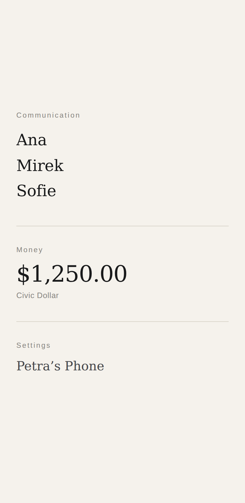
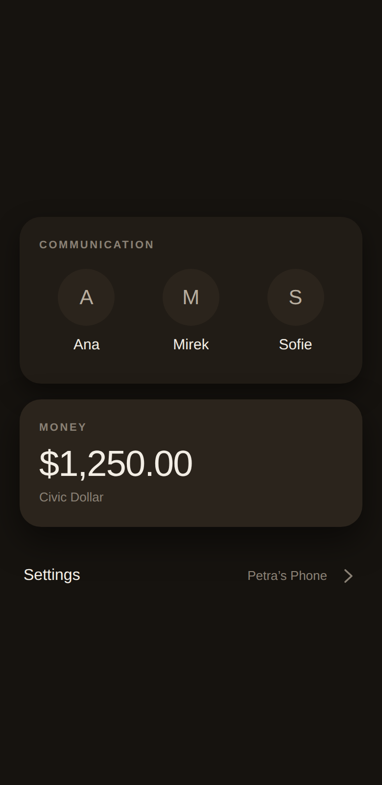
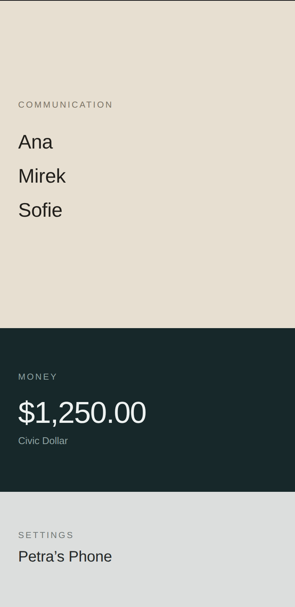

**A** centres the whole index vertically as a title page. Each Domain is a group
of type — a quiet sentence-case label with the Domain's most human content set
large beneath it — separated by hairlines. The person is the largest thing on the
screen; the Domain name is the smallest. The entire group is one tap target, so
tapping "Ana" enters Communication root rather than the conversation, as the
contract requires.

**B** composes two unequal objects and one non-object. Communication is the
largest surface and carries three represented people as monogram-and-name; Money
is a smaller, more elevated surface carrying the balance with the provider as a
caption. Settings is deliberately the only Home element with no surface at all —
it lies flat on the base ground as a single row. Quietness is structural, not
just chromatic.

**C** gives the frame to the Domains in proportion: Communication 54%, Money 27%,
Settings 19%, edge to edge, no gaps, never scrolling. The hierarchy is the
geometry. Home also previews each Domain's world, because the ground the user sees
on Home is the ground they will be standing in after they tap.

None of the three shows a badge, an unread count, a timestamp, a recency claim, a
notification, a battery, a clock, a signal indicator, or a VEYRA masthead.

### Communication root and conversation

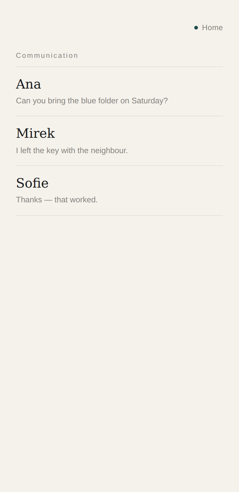
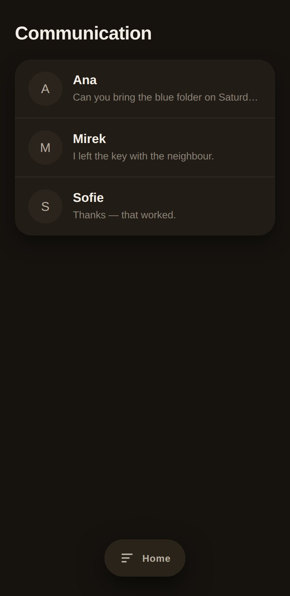
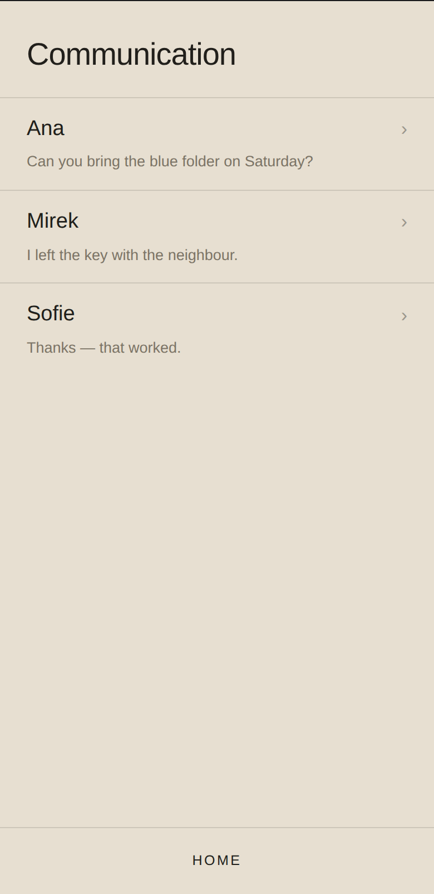

Every direction leads with the person's name and gives the represented preview a
quieter second line. No provider, address, protocol, mailbox or message
identifier appears anywhere. **A** sets names in the serif on hairline-separated
rows; **B** puts monogram-and-name rows inside one surface; **C** uses full-bleed
rows on the Communication ground.

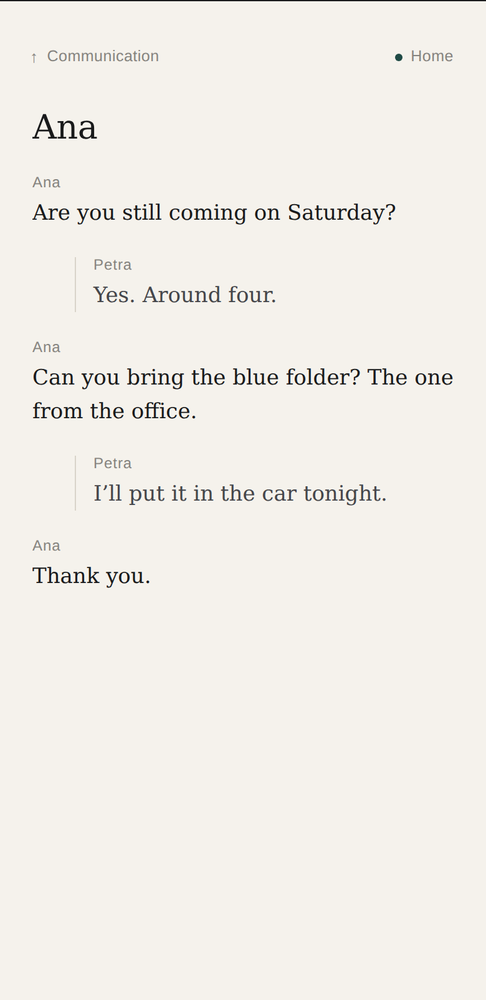
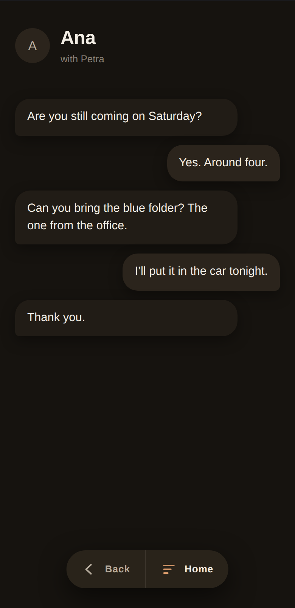
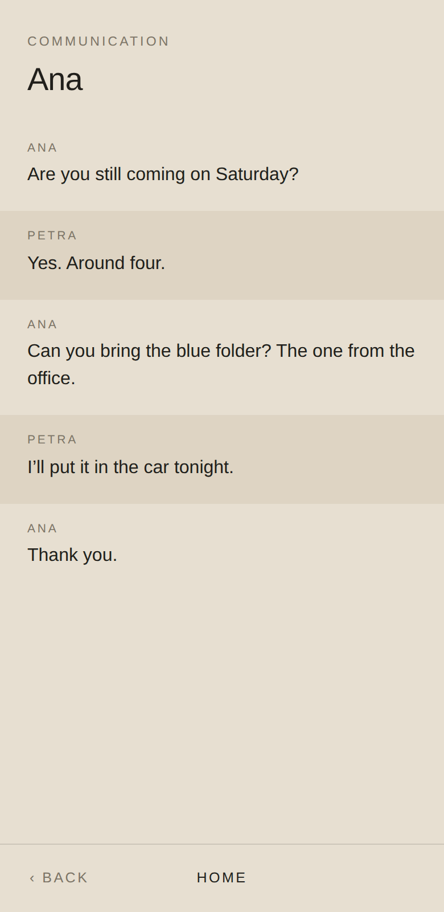

**A** renders the conversation as a reading transcript: each message is body type
with a small name above it, and the owner's own messages are indented behind a
hairline. **B** uses soft bubbles with the owner's side raised, and names the two
parties once in the header rather than labelling every message. **C** makes the
conversation a place: each message is a full-bleed band, and the owner's messages
sit on a slightly deeper tone of the same ground.

Three deliberate choices are shared:

- **The owner is named, not "You".** The outgoing party on this Device is the
  Device's owner, and the player is a visitor. Naming them is the cheapest way to
  make the screen say "this is somebody else's phone".
- **No composer.** §10.3 of the accepted contract permits a reply affordance only
  where the represented mechanics support replying, and foreign-phone
  communication truth is explicitly unresolved (§11, §33.A). Adding a composer
  here would have been an implementation promise this pass has no right to make.
  Where a reply affordance would sit, if a later mechanic represents one, is noted
  per direction in §7.
- **No timestamps, presence, read markers or delivery state.**

### Money

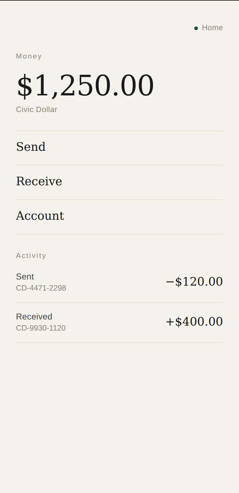
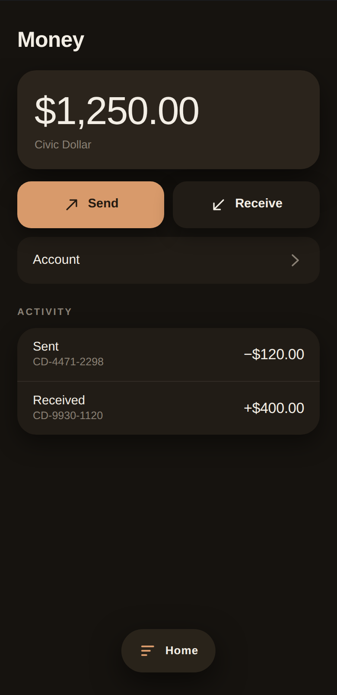
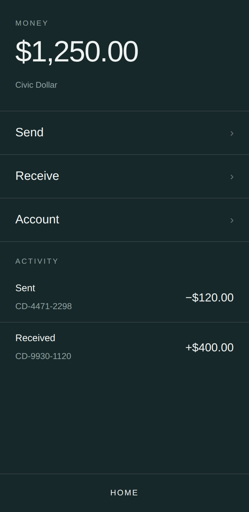

All three lead with the amount and demote `Civic Dollar` to a caption — the
inversion of the NODE Wallet's provider-first framing, and the inversion of a bank
app's account-first framing. None of them reskins the NODE Wallet: there is no
balance trajectory, no monogram identity module, no uppercase financial terms
list, no state chip, and no NODE section.

**A** treats Send, Receive and Account as three rows in the same grammar as every
other list in the OS. **B** is the only direction with a real action hierarchy: a
filled clay Send, an outlined Receive, and Account demoted to a row. **C** puts
the balance in the plane's headspace and the actions in the same full-bleed rows
the whole OS uses, on a ground that makes Money feel like a different room of the
same house.

Activity carries direction, counterparty reference and a signed amount, and
nothing else. Direction survives without colour in all three, because the word and
the explicit sign both carry it.

### Settings

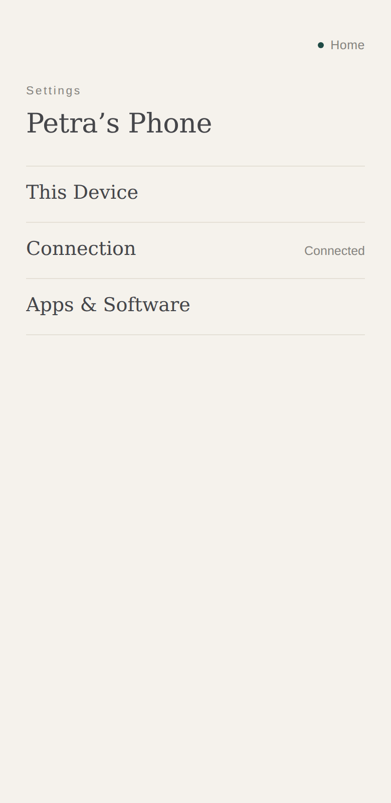
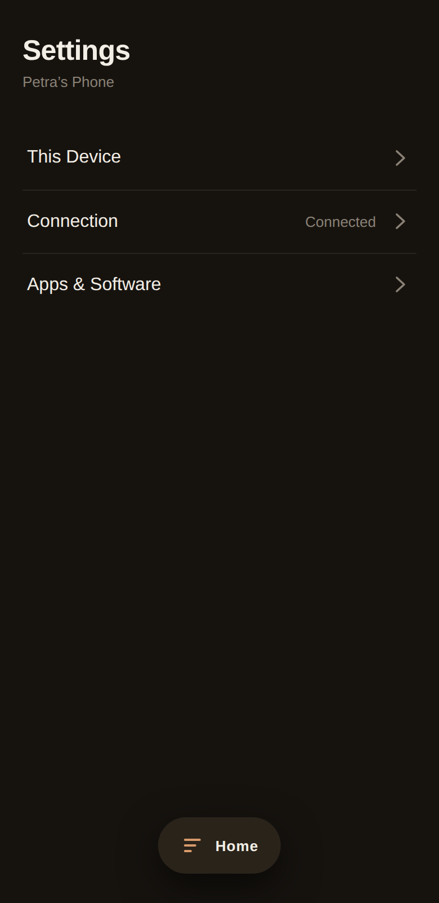
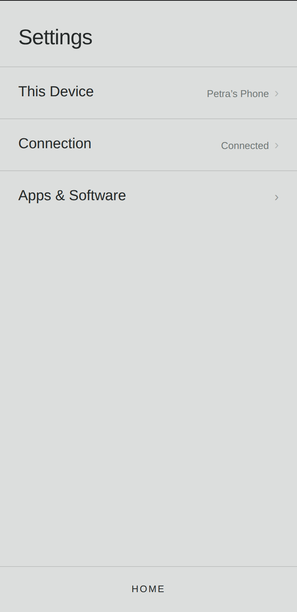

Three topics, no more: This Device, Connection, Apps & Software. Connection states
`Connected` as owner-facing Device connectivity; it is not the player's session.
Each direction expresses "quieter" differently — **A** drops the whole surface to
a softer ink, **B** removes the surface entirely, **C** uses its most neutral
ground.

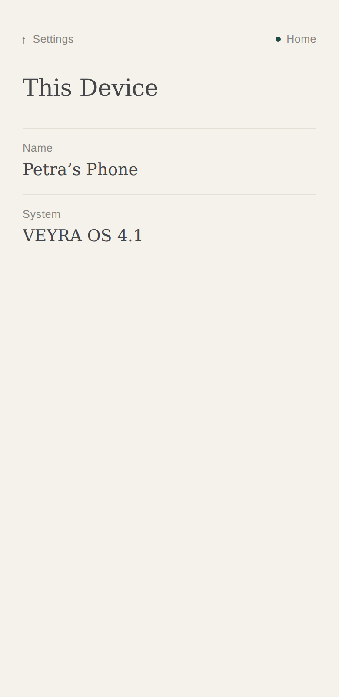
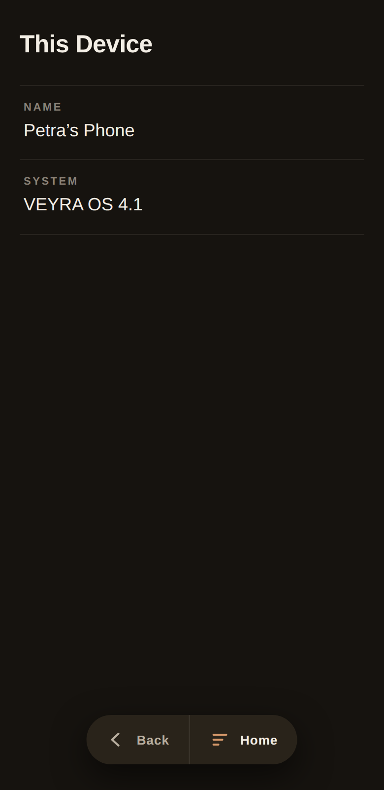
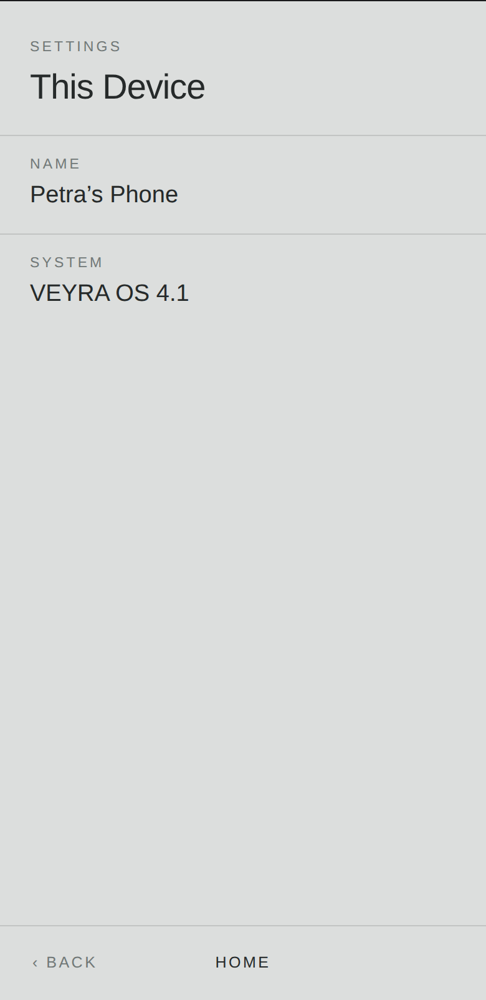

This Device shows two facts and then stops. That emptiness is the point, and it is
the single best test in the set of whether a visual language survives having
almost nothing to say. It is also where NODE and VEYRA diverge most sharply: NODE's
`THIS DEVICE` block states name, address, Firmware and network status as a facts
list, and NODE's System application goes considerably further. VEYRA states a name
and a system, and offers no battery, storage, security, diagnostics or telemetry —
because none is represented, and because a VEYRA owner would have no reason to
look.

### Boards

Full six-screen sets:
[A](../assets/veyra-first-ordinary-phone-v1/direction-a-board.png) ·
[B](../assets/veyra-first-ordinary-phone-v1/direction-b-board.png) ·
[C](../assets/veyra-first-ordinary-phone-v1/direction-c-board.png)

---

## 6. Back and Home

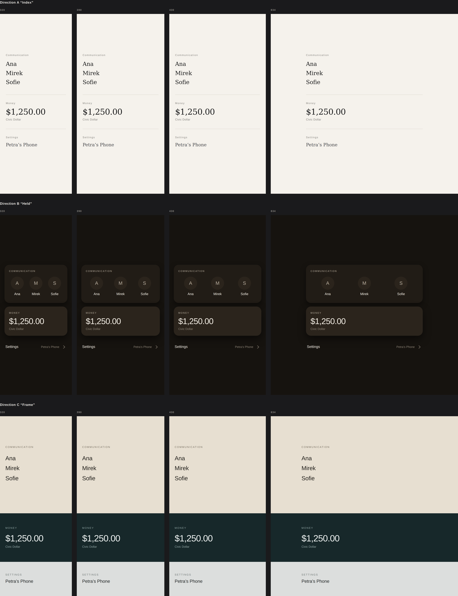

All three implement exactly the frozen grammar and nothing else: Back moves one
level up inside the current Domain, a Domain root carries no Back, and Home
returns to the personal index regardless of depth. No app switcher, recents,
tabs, cross-Domain history or gesture-only navigation appears in any direction.

**Superseded:** the current grammar retains one-level Back and return to VEYRA
Home, but Home is now the conventional app launcher defined by
[`VEYRA_FIRST_ORDINARY_PHONE_V1.md`](VEYRA_FIRST_ORDINARY_PHONE_V1.md), not a
Personal Index.

- **A** — a control line at the top of the column. Back names its destination
  (`↑ Communication`), which is the clearest of the three; Home is a small marked
  word at the right. Both are quiet, small and at the top of a tall screen: least
  reachable, and easiest to miss.
- **B** — a floating capsule at the bottom centre, always the same shape in the
  same place, gaining a Back half only at depth. Most discoverable, best placed
  for a thumb, and the clearest statement that Back and Home are OS operations
  rather than content. Costs roughly 110px of reserved vertical space on every
  screen below Home.
- **C** — a 60px edge band that belongs to the plane rather than floating over it,
  with Home centred and Back appearing at the left only at depth. Same thumb-zone
  advantage as B, no floating object, but its Back is a bare `‹ BACK` that does
  not name where it goes.

All three drop the control entirely on Home, because Home has nowhere upward to go
and no other index to return to. That is a shared position worth stating: the OS
shows a navigation control only where it leads somewhere.

Nothing in any direction offers a return to NODE. Leaving the foreign operating
surface belongs to the Synthesis Shell, which already owns that transition for
RACK-OS.

---

## 7. Motion, conceptually only

No motion system was built, and none should be. Each direction implies one
transition principle, offered as direction rather than specification:

- **A** — no spatial movement at all. Home → Domain is a cross-fade of type at a
  fixed position, because A has no surfaces to move.
- **B** — the tapped surface expands into the screen and contracts back on Home;
  the control capsule never moves, which is what makes it read as an object rather
  than a bar.
- **C** — the tapped region grows to fill the frame and the other two collapse
  into its edges; Home reverses it. The ground is continuous through the
  transition, which is the whole idea: you were already looking at where you are
  going.

None of these should be used to compensate for information architecture, and none
is required for a first implementation.

### Where a reply would go, if one is ever represented

Recorded so a later pass does not have to re-derive it: **A** would add a single
text control at the foot of the transcript column; **B** would add a second
surface below the thread, above the capsule; **C** would add a band in the
owner's ground directly above the edge band. None of these is proposed now.

---

## 8. Side-by-side critique

Against the evaluation matrix. "Yes" means the rendered screens actually show it.

| | A | B | C |
| — | — | — | — |
| 1 Home is a personal index | Yes — strongest as a literal index | Mostly; the people row edges toward a favourites widget | Yes — the only one where hierarchy is geometric |
| 2 Avoids app-launcher reading | Yes | Yes, but closest to a widget board | Yes |
| 3 Communication feels personal | Yes | Yes | Yes — most distinctive treatment |
| 4 Money consumer, no invented finance | Yes, but no action hierarchy | Yes — best action hierarchy | Yes, but no action hierarchy |
| 5 Settings interprets, not exposes | Yes | Yes | Yes |
| 6 Back / Home understandable | Clearest wording, worst placement | Most discoverable | Well placed, weakest wording |
| 7 Unmistakably not NODE | Yes — maximal contrast | Yes | Yes — structural, not only chromatic |
| 8 Not a generic iOS/Android clone | Yes | **Weakest** | Yes — strongest |
| 9 Grammar survives all six screens | Yes | Yes | Yes |
| 10 Implementable in the real viewport | Yes — simplest | Yes | Yes — maps onto how RACK-OS already mounts |
| 11 No fake telemetry or content | Yes | Yes | Yes |
| 12 Still VEYRA without a logo | Yes | Partly | Yes — strongest |

### Where each one is genuinely weak

**A.** Almost nothing looks tappable; the whole product relies on the user
trying. It has no action hierarchy, so Send carries exactly the visual weight of
Apps & Software. Most seriously, it reads *editorial* — a beautiful reading
product — where the accepted Company identity asks for dominant, premium-
**mainstream**, socially ordinary consumer technology. A phone that looks like a
literary journal is a different company from the one in
`VEYRA_COMPANY_PRODUCT_IDENTITY_V1.md` §4. Its serif-first identity is also the
most platform-fragile: the first choices in that stack exist on Apple platforms
and degrade elsewhere, changing the product's character rather than just its
texture.

**B.** Monogram avatars, rounded elevated cards, chat bubbles, a filled pill
primary action and a floating capsule are all mainstream consumer vocabulary.
It is the most immediately likeable of the three and the most likely to be
described as "a nice dark phone" rather than as VEYRA. It is the only direction
with a real generic-smartphone risk, and it is a real one. It also spends the
most vertical space on chrome.

**C.** Send, Receive and Account are three identical rows, so Money has no action
hierarchy — the same weakness as A. Back does not name its destination. The
non-scrolling Home is a strong commitment: it needs a stated rule for what happens
on a short viewport (the Shell already has a `max-height: 650px` case) and for what
happens if a fourth Domain ever earns a represented basis. Ground-per-Domain is
also a commitment — a dark Money plane inside an otherwise light OS reads as
arbitrary until the user has entered it once.

### Width behaviour

All three were checked at 320, 390, 430 and 834 CSS px. No label overflows, no
row clips and nothing overlaps at 320. At 834 each direction constrains its
measure rather than stretching it: A and B centre a 520px column, C keeps its
grounds full-bleed and grows the inset to a 560px measure. C's Home is the only
composition that is proportional to the frame at every width rather than
top-anchored, which is exactly why it is also the one that needs a short-viewport
rule.

---

## 9. Recommendation (round 1 — superseded by §11)

> **Superseded.** Human review did not take any direction wholesale. It selected
> C's visual language and B's product composition. The reasoning below is kept
> because the human decision agreed with part of it and overruled another part —
> notably C's Home, which this section did not identify as a problem. See §11.

**Direction C, “Frame”.**

Not because it is the prettiest — B is the most immediately likeable — but
because it is the only one of the three in which the frozen product structure is
expressed by the product itself rather than styled on top of a neutral layout.

- The accepted hierarchy Communication → Money → Settings is the geometry. It is
  not a stacking order that a future change could quietly flatten; it is 54 / 27 /
  19 percent of the frame.
- It passes the accepted contract's own hardest test — §34 question 14, "could the
  interface still be structurally distinguished from a normal app grid if all
  colours, icons, branding and styling were removed" — most strongly. Strip C to
  wireframe and it is still three unequal regions of a fixed frame carrying
  different kinds of content. Strip A and it is a text column; strip B and it is
  two boxes and a row, which is nearer to a widget board.
- It is simultaneously the furthest from NODE and the furthest from a generic
  iOS/Android launcher. It has no cards, no elevation, no rounding, no icons, no
  tab bar, no bubbles, no mono, no uppercase technical facts list and no launcher
  grid. A non-scrolling Home is genuinely unusual on a phone, which is worth
  something for a Device that must read as a different company's product.
- "Somebody else's ordinary environment" lands hardest in C's conversation, where
  the correspondence is the place rather than an object inside a chat client.
- It maps onto the real Synthesis Shell most naturally. RACK-OS already mounts a
  foreign Firmware surface full-bleed across the whole Shell with its own palette;
  a ground-owned, edge-to-edge VEYRA plane is exactly that shape, and C needs no
  shadow system, no icon set and no font beyond the system stack.

### Risks to accept with it

1. **No action hierarchy in Money.** Must be fixed before implementation.
2. **Back does not name its destination.**
3. **The non-scrolling Home needs an explicit rule** for short viewports and for a
   fourth Domain. Until that rule exists, C's best idea is also its most brittle.
4. **Ground-per-Domain is a commitment.** Adding Domains later means adding
   grounds, and the palette has to stay muted and legible in both text directions.
5. Its uppercase tracked micro-labels are the one place C brushes against NODE's
   voice.

### What to carry over from the directions not chosen

- **From B: the action hierarchy.** A filled primary action for the one
  consequential thing on a surface, an outlined secondary, and navigation demoted
  to a row. This is the single clearest improvement available to C, and it is
  already an accepted idea in the repository — the NODE Wallet reserves its filled
  treatment for exactly the same purpose.
- **From B: naming the two parties once in the conversation header** rather than
  labelling every message. C should adopt this and drop its per-message labels,
  keeping the ground change as the speaker signal.
- **From A: Back naming its destination.** `‹ Communication` costs nothing and is
  strictly clearer than `‹ Back`.
- **From A: sentence-case micro-labels.** This removes C's only NODE-adjacent
  trait at no cost.
- **From A: the serif for personal subjects**, if a later pass wants more warmth —
  but confined to the Communication ground, and only with a stack that degrades
  acceptably off Apple platforms. This is optional and it is the one carry-over
  that could muddy C's identity, because C's discipline is one family at one
  weight. Try it; discard it quickly if it dilutes.

This recommendation is a recommendation. It is not accepted, and the human
selection is the next step.

---

## 10. What this work did not do

No production code, `GameState`, Shell routing, Remote Session, NODE application,
style token or test was changed. No gameplay or domain implementation occurred. No
VEYRA OS, operating surface, Firmware dispatch, Personal Domain framework,
communication truth, financial provider, Device model, NPC, or app was
implemented. `docs/current/` and `docs/architecture/` are unchanged, and neither accepted
VEYRA contract was edited — the routing entry for this document lives in the
documentation portal, where routing belongs.

Implementation remains subject to the prerequisites the revised accepted
contract names in its §10: concrete first-phone representation,
Firmware-driven foreign-surface selection at the Shell boundary, and a truthful
represented basis and ownership boundary for each visible Home entry. Historical
visual selection does not unblock any of them.

---

## Round 2 — historical human review and superseded candidate (§11–§14)

## 11. Human review result

Round 1 succeeded by exposing which parts of each direction work rather than by
producing a winner. The human decision is:

| | Result |
| — | — |
| **Direction A “Index”** | **Not selected as a base.** |
| **Direction B “Held”** | **Strongest product / interaction composition** for Home, Communication and Money. |
| **Direction C “Frame”** | **Strongest visual language** overall — typography, restraint, cleanliness, spacing, colour. |
| **Direction C Settings / This Device** | Selected as the **strongest visual anchor** in the whole exploration. |
| **Direction C Home** | **Explicitly rejected.** |

C's Home is rejected outright, not refined. Nothing of its fixed frame, its three
full-height Domain regions, its 54 / 27 / 19 split, or its whole-screen Domain
colour segmentation survives.

The historical Round 2 outcome was therefore neither direction. It was one
deliberate synthesis, since superseded as a current candidate:

```text
C VISUAL DISCIPLINE
        +
B PRODUCT COMPOSITION
```

with this ownership:

```text
GLOBAL VISUAL LANGUAGE   -> C
HOME COMPOSITION         -> B-derived, on C's surface
COMMUNICATION ROOT       -> B-derived, on C's surface
CONVERSATION DETAIL      -> B-derived, refined away from chat-app convention
MONEY HIERARCHY          -> B-derived, on C's surface
SETTINGS                 -> C
THIS DEVICE              -> C, treated as the anchor
NAVIGATION               -> C's edge, refined to name its destination
```

---

## 12. Historical B/C candidate — superseded

This candidate was selected only within the former Personal Index exploration.
It is not the selected final candidate or current visual authority. Its Home and
all Home-dependent navigation wording are superseded. Communication, Money, and
Settings work may remain reference input for a revised pass.

Prototype:
[`prototypes/veyra-first-ordinary-phone-v1/selected-hybrid.html`](prototypes/veyra-first-ordinary-phone-v1/selected-hybrid.html).

Board:
[`selected-hybrid-board.png`](../assets/veyra-first-ordinary-phone-v1/selected-hybrid-board.png).

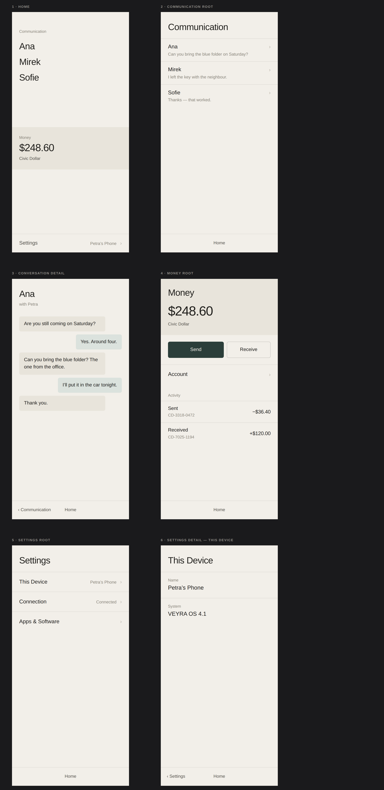

### The system, stated once

These rules hold in every Domain. Only content hierarchy varies.

- **One ground family.** Paper (`#f2efe9`) is the world; one tone deeper
  (`#e8e4db`) is a recessed full-bleed band; a cool sibling of it (`#dbe2dd`) is
  the owner's own voice. There is no third surface, and there are **no cards** —
  every recessed area runs edge to edge.
- **No shadows anywhere.** Depth is tone, never elevation. This is what removes
  B's heavy dark cards without losing B's composition.
- **Rounding only on filled objects** (6px): messages and actions. Rows, bands
  and the page never round.
- **One type family, two weights** (400 and 500). Hierarchy is size and space.
  Nothing is bold to be important.
- **Labels are sentence case.** `Communication`, `Money`, `Activity`, `Name`,
  `System`. C's tracked uppercase micro-labels are gone; they were the one place
  the visual language still sounded like NODE in a lighter colour.
- **At most one filled surface per screen**, spent on the single consequential
  action. In the whole six-screen set that is exactly one object: `Send`.
- **Rows are full-bleed and hairline-separated**, in every Domain.

The last two rules are what answers the "would it still be VEYRA without a logo,
the word VEYRA, or the accent colour" test. Strip the accent and `Send` is still
the only filled object on any screen; strip all colour and the recessed value
band, the full-bleed rows, the sentence-case labels and the quiet edge are still
a specific product grammar rather than a generic one.

### Home

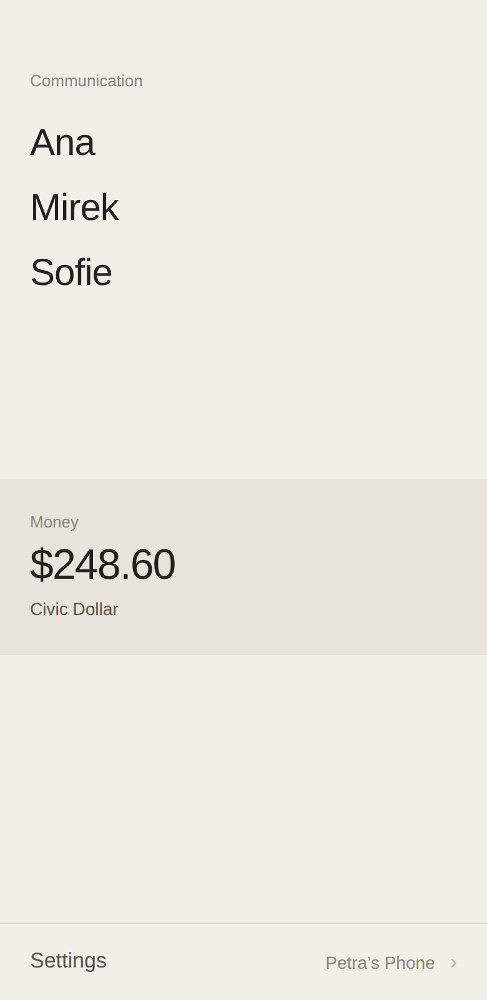

Built from B's unequal-composition thinking, on C's surface, with C's Home
discarded entirely.

- **Communication dominates through human content.** The people are the largest
  type on the screen (30px) and the first thing present. They carry no avatars,
  no previews, no counts and no metadata — which is also how Home stays distinct
  from Communication root, where previews and chevrons appear.
- **Money is compact but clearly valuable.** It is a single recessed full-bleed
  band carrying the amount, with the provider beneath it. This is the one idea
  carried forward from C's rejected Home — a ground change — but spent *once*, on
  *one subject*, at a height that reads as a value rather than as a coloured
  region. It is not a card: it has no radius, no shadow and no margin.
- **Settings is a single quiet row at the bottom edge**, in secondary ink, above
  a hairline, with the Device name as its side value.
- The two breaths are deliberately unequal — smaller between the people and the
  money, larger between the money and Settings — so the descent from the person's
  life to the Device's management reads as hierarchy rather than as a gap.
- Home carries **no navigation control at all**, because Home has nowhere upward
  to go, and **no masthead**, because the contract forbids proving the brand with
  chrome.

### Communication root and conversation

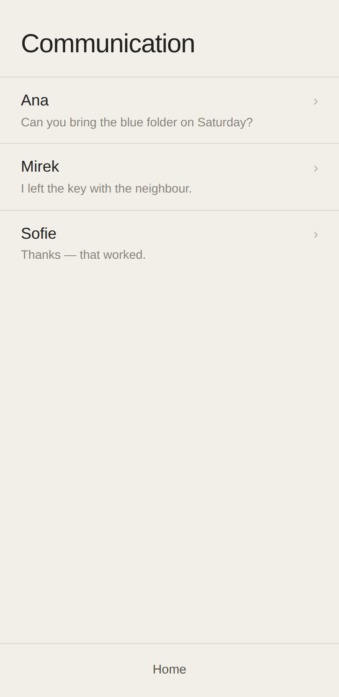
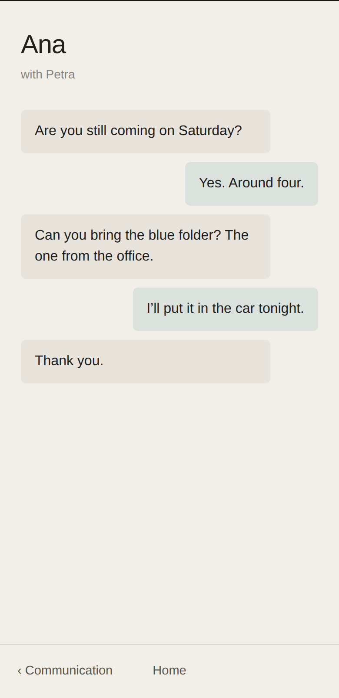

B's people-first, scannable composition, minus its generic-smartphone vocabulary:
**no avatar circles**. The name is the subject at 18px/500, the represented
preview is one quiet ellipsized line, and the row is C's full-bleed hairline row —
the same row used by Settings and by Money's Account.

The conversation keeps B's two-sided grammar and refines the bubble toward VEYRA:
flat, unelevated, single 6px radius, no tail, no timestamp, no read marker, no
presence, no per-message labelling. The two people are separated by tone and
alignment alone — warm stone for the correspondent, its cool sibling for the
owner — which is legible at a glance without either voice becoming loud.

The two parties are named once, in the header (`Ana` / `with Petra`). Naming the
owner rather than writing "You" is the cheapest way to say *this is somebody
else's phone*, and it commits to no Person model, no owner identity and no
canonical correspondent.

There is still **no composer**, for the same reason as round 1: foreign
communication truth is unresolved, and a composer would be an implementation
promise.

### Money

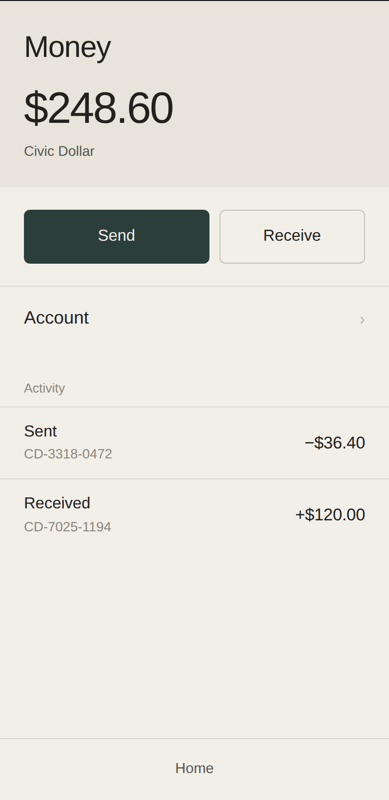

B's information and action hierarchy kept intact and not flattened into equal
rows:

```text
BALANCE    primary subject, largest type on the screen, on the recessed band
PROVIDER   secondary, a quiet line beneath it
SEND       primary action, the only filled surface in the system, given more width
RECEIVE    secondary action, outlined
ACCOUNT    tertiary, an ordinary full-bleed row
ACTIVITY   compact supporting information
```

The recessed band is the same object as Home's money band, at a larger scale —
which is what ties the Domain to the index without a coloured Domain ground.

It is not a bank app: there is no card art, no chart, no category, no merchant,
no fee, no pending state, no timestamp. Activity carries direction, counterparty
reference and a signed amount, and direction survives without colour because the
word and the explicit sign both carry it.

### Settings and This Device

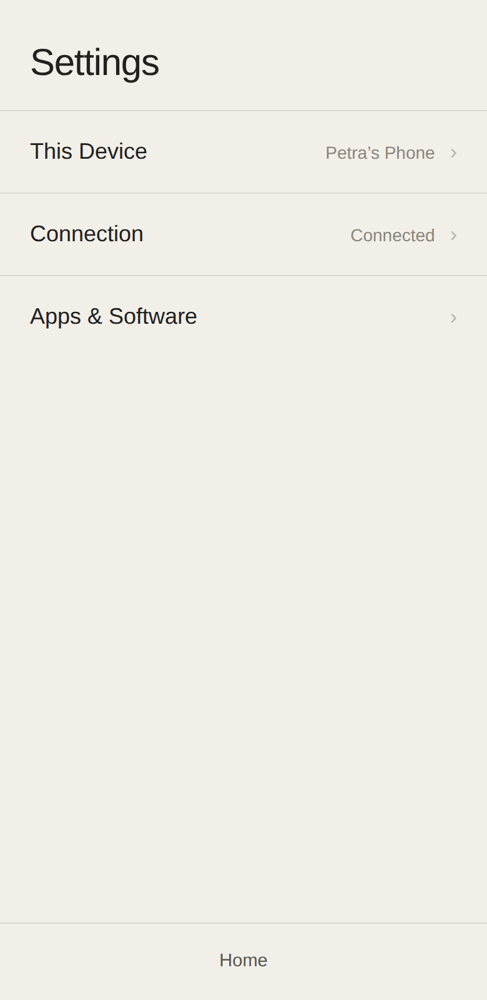
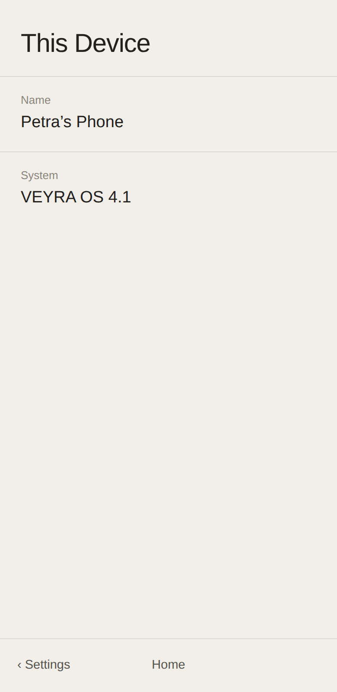

C, preserved almost directly, because this is what human review called the
anchor: a quiet title, simple full-width rows, no card container, almost no
decoration, generous but controlled spacing, subdued secondary state, clean
ground.

This Device states two facts and stops. Nothing was added to make it look
complete — no battery, storage, serial, security, update state, CPU, RAM or
network detail. That restraint is the clearest proof in the set of VEYRA's
philosophy: the Device contains complex truth and the owner has no reason to see
it.

### Navigation

C's edge, refined. It is part of the ground rather than an object floating over
it, so B's capsule — ergonomic but generic consumer chrome — is not carried
forward. The refinements over C are that it speaks in sentence case, and that
**Back names its destination**:

```text
Domain root      ->  Home
Domain detail    ->  ‹ Communication        Home
                     ‹ Settings             Home
Home             ->  no control at all
```

Historical semantics were: Back is one level up inside the current hierarchy,
Home returns to the Personal Index, and neither means return-to-NODE. The
Personal Index destination is **superseded**: current semantics return to the
conventional VEYRA app Home defined by the accepted first-phone contract. No app
switcher, tab bar, recents or gesture-only navigation was explored here.

---

## 13. Refinement performed on the rendered candidate

The first assembly was rendered and rejected on three counts, each fixed and
re-rendered:

1. **Home had a ~300px void.** Pinning Settings to the bottom edge left one large
   hole rather than composition. Fixed by distributing the space into two unequal
   breaths and tightening the people to their label, so the screen descends
   instead of gapping.
2. **The two voices in the conversation were barely separable.** The owner's tone
   was too close to the correspondent's, leaving alignment to do all the work.
   The cool tone was strengthened until both are legible at a glance while both
   stay quiet.
3. **Send and Receive were equal width**, which undercut the action hierarchy the
   fill was meant to establish. Send now takes more of the row.

### Width behaviour

Verified at 320, 390, 430 and 834 CSS px
([width board](../assets/veyra-first-ordinary-phone-v1/width-plausibility.png), last
row). No label overflows, no row clips and nothing overlaps at 320. At 834 the
measure is held at 560px while the recessed band stays full-bleed, so the layout
widens without the text line growing.

---

## 14. Self-test on the candidate

| Question | Answer |
| — | — |
| Does it look like one operating system? | Yes — one ground, one row, one edge, one type scale, one filled-action rule across all six screens. |
| Did B's composition survive? | Yes — unequal Home, people-first Communication, two-sided conversation, and Money's full Send / Receive / Account hierarchy. |
| Did C's cleanliness survive? | Yes — no cards, no shadows, hairline rows, generous spacing, low saturation, large calm subjects. |
| Does Home work now? | Yes, and it is no longer three coloured slabs. It reads as a person's index with a compact value and a quiet Device row. |
| Is Home still not a launcher? | Yes — no grid, no tiles, no icons, no equal cells; three unequal groups of real content. |
| Does Communication feel personal? | Yes, and without avatar circles or chat-app decoration. |
| Does Money keep real action hierarchy? | Yes — one filled primary, one outlined secondary, one tertiary row. |
| Do Settings and This Device keep what made C strong? | Yes — they are the least changed screens in the set. |
| Is it "iOS with beige colours"? | No. No tab bar, no card stacks, no grouped-inset table views, no blue, no avatars, no shadows, no large-title collapse, no floating home indicator. Familiar where familiarity is useful; the grammar is its own. |
| Is it "NODE in a lighter colour"? | No. Nothing is monospace, nothing is tracked uppercase, there is no facts-list chrome and no technical value anywhere. |
| Would it still be VEYRA without the logo, the word, or the accent? | Yes — the one-filled-action rule, the recessed value band, the full-bleed rows and the quiet edge carry it structurally. |
| Has it invented represented truth? | No. No battery, storage, signal, clock, notification, badge, unread count, timestamp, presence, fee, merchant, category or pending state, and no Remote Session leakage into owner-facing Connection. |

### Open questions the human should decide

1. **The illustrative balance.** `$248.60` is deliberately not the represented
   `$1,250.00`. If a later concrete phone represents its own financial
   relationship, that number changes; nothing here selects one.
2. **Home's whitespace.** The candidate treats the space below the money band as
   hierarchy. It is the largest single judgement call in the set, and it is the
   thing most likely to want a second opinion on a real device.
3. **Where a reply would sit**, if foreign communication ever represents one: a
   single field in the owner's tone directly above the edge band. Not proposed
   now.

This candidate is still **Draft / Candidate. NOT Accepted.** Human review comes
next, and the accepted visual authority does not exist yet.
